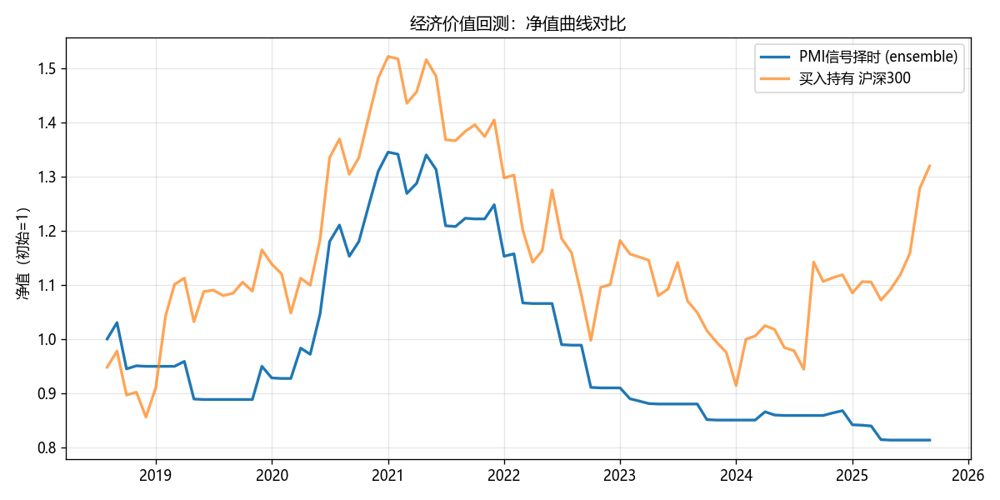

# PMI Nowcasting — 制造业景气度即时预测

> 用央行真在用的 **Nowcasting** 方法，预测下月制造业 PMI 是否站上荣枯线（>50）。
> 卖点不是技术栈，而是**方法论的严谨性**：时点意识、walk-forward 验证、系统性防数据泄漏、经济价值评估。


> CI 在 Python 3.10 / 3.12 上跑 ruff lint + 全部单测。



---

## 一句话摘要

在 2008–2025 共 210 个月的样本上做**扩展窗口 walk-forward** 样本外预测。
最诚实的发现分两层:

1. **荣枯任务(下月 PMI 是否 >50)**:朴素持续基准 AUC 0.733,ML 单模型打不过它。等权
   **混合集成**名义 AUC 升到 0.750,但**自助配对检验证明这点优势不显著**(ΔAUC +0.018,
   95%CI [-0.044, +0.077],p=0.565)——我不仅报告了差异,还证明了它跨不过抽样噪声。
2. **方向任务(下月 PMI 较本月上行/下行)**:换个问法,**ML 反超**(XGBoost AUC 0.656
   vs 持续基准 0.329)。同一管线、两个问题、两个相反结论——这才是小样本宏观预测的真实图景。

**特征消融**进一步揭示:唯一不可或缺的是 **PMI 自身惯性**(拿掉 AUC 崩到 0.550),其余
宏观组拿掉反而 AUC 微升——在两百行样本上,多加特征常是净噪声。报告这些对比,
比报一个虚高的准确率更有价值。

## 1. 背景:什么是 Nowcasting,为什么预测 PMI 有价值

PMI(采购经理指数)是最抢先发布的景气指标之一,月末即出。但它本身在荣枯线附近反复横跳,
"下月会否扩张"对宏观择时、行业配置都有直接意义。**Nowcasting** 是美联储、欧央行、IMF
在用的技术:用高频、抢先发布的数据"抢跑"预测发布滞后的低频指标。本项目即用截至当月
真正可得的金融/实体/价格数据,预测下月 PMI 的荣枯方向。

## 2. 数据与方法

### 2.1 数据源
全部经 [akshare](https://akshare.akfamily.xyz/) 程序化拉取并带时间戳缓存(`data/raw/`),可复现。

| 组别 | 指标 | 经济含义 |
|------|------|---------|
| ① 领先/金融 | M1、M2 同比,**M1-M2 剪刀差**,**新增信贷同比** | 信用扩张领先景气 |
| ② 实体活动 | 工业增加值同比、PPI | 当下生产热度 |
| ③ 需求/价格 | CPI、PPI 同比 | 需求与价格冷热 |
| ④ 预期/情绪 | 上月 PMI 及其 lag | 自相关性最强 |

> **信用信号数据说明**:原计划用社融存量(`macro_china_shrzgm`),但其数据源
> `data.mofcom.gov.cn` 只支持旧 TLS 配置,与本机 Python 的 OpenSSL 3.0.18 无法完成
> 握手(`SSLV3_ALERT_HANDSHAKE_FAILURE`)——系统 openssl 命令行可连通,证明是 Python
> 运行时的加密库兼容问题,非网络不可达。改用 **新增信贷当月同比**
> (`macro_china_new_financial_credit`,东财源,2008–今 222 月完整),它是社融的核心分项、
> 同样刻画信用扩张,历史更长且无 SSL 障碍。另叠加 **M1-M2 剪刀差**作为经典信用周期信号。

### 2.2 三大方法论升级(项目的真正支点)

**① Point-in-Time 时点对齐(`calendar.py`)** — 避免"未来函数"。
每个指标按其**发布滞后**向后移位:预测 6 月 PMI 时,站在 5 月末,5 月工业增加值可能还没发。
`PUBLICATION_LAG` 表显式编码"某月数据到第几个月才可得",对齐后每一行只含"该时点真正拿得到"的信息。

**② Walk-Forward + Purging/Embargo(`validation.py`)** — 绝不用随机 K 折。
扩展窗口滚动前推:每期用截至当时的全部历史重训,预测下一期。再叠加 López de Prado
《Advances in Financial Machine Learning》的两道防线:
- **Purging**:剔除训练集末尾与测试期时间重叠的样本(因标签依赖 PMI(t+1)、特征含 lag)。
- **Embargo**:训练/测试间再留缓冲月,隔离自相关泄漏。

该模块独立、可单测——`tests/` 里用构造数据验证"测试期样本绝不进训练集"。

**③ 经济价值回测(`backtest.py`)** — 从"准确率"到"钱"。
把信号翻译成简单择时(预测扩张→持沪深300,收缩→持币),画净值曲线 vs 买入持有,算夏普与最大回撤。
回测**计入交易成本**(默认每次仓位切换扣 10bp 单边),并做成本敏感性扫描(0/5/10/20/30bp),
诚实呈现策略优势如何随摩擦侵蚀——见 `outputs/cost_sensitivity.csv`。

### 2.3 防泄漏总原则(黄金句:"我系统性地防范了数据泄漏")
- 时点对齐:特征按发布滞后可得性移位。
- 滚动标准化只用训练窗口统计量(`logreg` 的 `StandardScaler` 内嵌 Pipeline,每折仅在训练集 fit)。
- Walk-forward + purge/embargo。
- 标签是唯一允许的前视(它就是预测目标),特征列严格排除任何 `pmi_next` 派生量。

## 3. 结果(全部为 walk-forward 样本外)

### 3.1 荣枯任务:分类指标 + 概率校准(Brier)

| 模型 | Accuracy | Precision | Recall | F1 | AUC | Brier |
|------|---------|-----------|--------|-----|-----|-------|
| **ensemble**(RF+持续 融合) | 0.733 | 0.714 | 0.732 | 0.723 | **0.750** | **0.200** |
| naive_persistence | 0.733 | 0.714 | 0.732 | 0.723 | 0.733 | 0.267 |
| random_forest | 0.721 | 0.774 | 0.585 | 0.667 | 0.706 | 0.205 |
| xgboost | 0.628 | 0.588 | 0.732 | 0.652 | 0.704 | 0.260 |
| logreg | 0.674 | 0.783 | 0.439 | 0.562 | 0.610 | 0.264 |
| naive_majority | 0.477 | 0.477 | 1.000 | 0.646 | 0.561 | 0.328 |

> **Brier 分数**(越小越好)衡量概率校准——nowcast 输出的是概率,不只是硬分类。
> 集成与 RF 校准最好(0.20),持续基准虽 AUC 高但只吐 0/1 概率,校准差(0.27)。
> 见 `outputs/calibration_curve.png` 可靠性曲线。数值由 `python -m pmi_nowcast.train`
> 在最新数据上生成,会随 akshare 数据更新而略变。

### 3.2 集成 AUC 的名义优势,统计上不显著

集成把 AUC 从 0.733 抬到 0.750,看似"做得更好"。但**必须检验这是真实差异还是噪声**
(`significance.py`,2000 次自助重采样):

| 对比 | ΔAUC | 95% 自助 CI | 配对 p 值 | McNemar p |
|------|------|-------------|-----------|-----------|
| ensemble − naive_persistence | +0.018 | **[-0.044, +0.077]** | 0.565 | 1.000 |

CI **跨 0**、p 远大于 0.05 → **"打平"结论成立**。McNemar 更揭示:二者**硬预测逐点完全相同**
(分歧样本 0 个),集成的 AUC 增益仅来自概率排序更细,不改变任何一次涨跌判断。
**报告"我的提升不显著",是比虚报 0.02 AUC 更成熟的研究态度。**

### 3.3 特征组消融:只有 PMI 惯性不可或缺

逐组剔除特征、重跑完整 walk-forward,看样本外 AUC 变化(`ablation.py`):

| 剔除的特征组 | 剩余特征数 | OOS AUC | ΔAUC |
|-------------|-----------|---------|------|
| (全特征基准) | 26 | 0.706 | 0.000 |
| **PMI 惯性** | 21 | 0.550 | **−0.156** |
| 实体活动(工业增加值) | 23 | 0.715 | +0.009 |
| 货币金融(M1/M2/剪刀差) | 23 | 0.723 | +0.017 |
| 信用(新增信贷) | 17 | 0.726 | +0.020 |
| 价格(CPI/PPI) | 20 | 0.742 | +0.036 |

**只有拿掉 PMI 自身惯性会让预测显著变差**;拿掉任何其他宏观组反而让 AUC 微升——
在 ~210 行样本上,额外宏观特征更多是噪声而非信号。这个"减法实验"比单看一次特征重要性
更有说服力:它是样本外、端到端的因果式验证。见 `outputs/ablation.png`。

### 3.4 第二任务:方向预测(上行 vs 下行)——这里 ML 反超

把标签换成"下月 PMI 是否较本月上行",同一管线几乎零改动即得第二组结论:

| 模型 | Accuracy | F1 | AUC |
|------|---------|-----|-----|
| xgboost | 0.640 | 0.475 | **0.656** |
| random_forest | 0.640 | 0.508 | 0.635 |
| logreg | 0.558 | 0.472 | 0.617 |
| naive_persistence | 0.337 | 0.260 | 0.329 |

**方向任务里持续基准彻底失效**(PMI 涨跌几乎无自相关),ML 明显胜出。这恰好反衬 3.1:
荣枯任务 ML 打不过持续,不是模型无能,而是**该任务的信息几乎全在 PMI 惯性里**,
没有额外可学的东西——换个持续基准占不到便宜的问法,ML 的价值立刻显现。

### 3.5 SHAP 特征贡献:把树模型的每次预测拆成加性归因

特征重要性只说"谁重要",SHAP 进一步说"某特征值高/低时,把预测往扩张还是收缩推、推多少"
(`shap_analysis.py`,行业标准可解释性)。蜂群图 `outputs/shap_summary.png` 显示:
**PMI 当期值高(红点)一致把预测强力推向扩张、低值(蓝点)推向收缩**,方向与经济直觉完全吻合;
`m1_yoy`、`ip_yoy` 次之但贡献带更窄。平均 |SHAP| 排序(`shap_importance.csv`)与逻辑回归系数、
树重要性、消融四者相互印证——**PMI 自身惯性是压倒性的主导信号**,可解释性证据链闭合。

### 3.6 验证稳健性:扩展窗口 vs 固定滚动窗口

宏观关系是否随时代"结构性漂移"?若漂移,只用近期历史(滚动窗口)应更好;若关系稳定、
样本珍贵,用尽全部历史(扩展窗口)更好。对每个模型两种窗口各跑一遍 walk-forward
(`rolling_window_splits`,固定 120 月窗口 vs 扩展窗口),对比样本外 AUC:

| 模型 | 扩展窗口 AUC | 滚动窗口 AUC | Δ(滚动−扩展) |
|------|-------------|-------------|-------------|
| ensemble | 0.750 | 0.763 | +0.013 |
| naive_persistence | 0.733 | 0.733 | 0.000 |
| random_forest | 0.706 | 0.712 | +0.006 |
| xgboost | 0.704 | 0.700 | −0.003 |
| logreg | 0.610 | 0.599 | −0.011 |

**两种窗口的 AUC 差异全部在 ±0.013 以内**,主要结论(ensemble≈persistence、ML 打不过持续)
在任一窗口下都不翻盘。这说明:①宏观关系无剧烈结构断点,扩展窗口"用尽历史"的假设站得住;
②本项目的结论**不是特定验证设计的偶然产物**——这才是对"验证方法本身"的稳健性检验。
见 `outputs/window_comparison.csv`。

### 3.7 分时期表现拆解:模型在哪些宏观阶段更准/更险

整体一个 AUC 会掩盖"某些时期特别准、某些时期近乎失灵"。按中国宏观史划分有经济含义的阶段,
分别算 `ensemble` 的样本外准确率与 AUC(`outputs/regime_breakdown.png`):

| 时期 | n | Accuracy | AUC | 期间扩张占比 |
|------|---|---------|-----|-------------|
| 贸易战(18–19) | 17 | 0.706 | 0.621 | 0.35 |
| 疫情冲击(20) | 12 | 0.917 | 1.000 | 0.92 |
| 后疫情反复(21–22) | 24 | 0.667 | 0.721 | 0.58 |
| 弱复苏(23–) | 33 | 0.727 | 0.696 | 0.30 |

> **样本外评估从约 2018 年中才开始**——因首个训练窗口要求至少 120 个月(2008–2017 全部
> 用作最初训练),这正是 walk-forward 严谨性的代价,也是本项目主动披露的口径。
> 有意思的是:**疫情冲击期反而最准(AUC=1.0)**——2020 年 PMI 剧烈跳水又深 V 反弹,
> 荣枯方向被 PMI 惯性一眼看穿;真正难的是**后疫情反复(21–22)**,景气在荣枯线附近拉锯,
> 准确率跌到 0.667。分时期拆解让"整体 0.75"背后的冷热不均无所遁形。

### 3.8 最强领先信号

逻辑回归系数 + 树重要性 + SHAP + 消融四者一致:**PMI 自身**惯性最强(当期/lag/环比),
其次是 **M1 同比**、**工业增加值**、**PPI 环比**——与第 2 节经济逻辑吻合。

## 4. 结论与局限

- **荣枯任务:ML 没有统计显著地打过 naive_persistence。** 集成 AUC 名义更高(0.750 vs 0.733),
  但 bootstrap 差检验 p=0.565、CI 跨 0——**这点优势跨不过抽样噪声**。诚实报告"打平且不显著"
  > 虚报"我的模型 AUC 更高"。这不是失败,而是荣枯线附近预测的固有难度:PMI 长期在 49–51 横跳。
- **消融证明信息几乎全在 PMI 惯性里**:拿掉 PMI 组 AUC 崩到 0.550,拿掉任何其他宏观组反而微升。
  荣枯任务 ML 打不过持续,不是模型无能,而是**没有 PMI 惯性之外可学的东西**。
- **方向任务里 ML 明显胜出**(XGB 0.656 vs 持续 0.329):换个持续基准占不到便宜的问法,
  ML 的价值立刻显现——反证了上一条。
- **小样本(~210 行)**:坚决不用深度学习;靠强正则、浅树、严格样本外验证控制过拟合。
- **无完整 vintage**:国内难拿修订前数据,本项目只显式处理**发布滞后**,数据修订(vintage)
  问题在此讨论而非假装解决。
- **回测非真实策略**:已计入交易成本并做敏感性扫描,但仍为月频、单标的、无滑点/冲击成本的
  简化择时,仅示意信号有无经济价值,非可直接交易的策略。本项目样本中该信号**零成本下年化即为负**,
  说明经济价值不来自成本假设,而是信号本身在小样本上难以稳定获利。

## 5. 如何复现

```bash
pip install -e .            # 安装(核心依赖)
pip install -e ".[advanced]"  # 可选:xgboost / shap / streamlit
python -m pmi_nowcast.train   # 一条命令跑通:拉数→对齐→训练→评估→回测
pytest                        # 跑防泄漏等关键单测
```

产出在 `outputs/`:两任务的样本外预测与指标汇总、显著性检验表、消融表、窗口对比表、
分时期拆解表、SHAP 重要性表、系数/重要性;以及净值曲线、校准曲线、消融条形图、
分时期条形图、SHAP 蜂群图/条形图等图表。

## 6. 项目结构

```
src/pmi_nowcast/
├── config.py         指标清单、发布滞后表、参数
├── ingest.py         akshare 拉数 + 时间戳缓存
├── calendar.py       ★时点对齐 / 发布滞后(升级1)
├── features.py       lag / 环比 / 剪刀差等精简特征
├── dataset.py        组装训练表 + 标签(严格时点对齐)
├── validation.py     ★walk-forward(扩展窗口 + 固定滚动窗口)+ purge/embargo(升级2)
├── models.py         LogReg / RF / XGBoost / 朴素基准 / 软融合集成 统一接口
├── evaluate.py       样本外指标(含 Brier) + 可靠性曲线 + 可解释性
├── significance.py   ★bootstrap AUC 置信区间 + 配对差检验 + McNemar
├── ablation.py       ★特征组消融(逐组剔除看样本外 AUC 变化)
├── shap_analysis.py  ★SHAP 特征贡献归因(蜂群图 / 条形图)
├── backtest.py       ★信号→净值曲线 + 交易成本(升级3)
└── train.py          总驱动(两任务 + 显著性 + 校准 + 消融 + 窗口对比 + 分时期 + SHAP + 回测)
tests/                40 项单测:对齐 / walk-forward / 滚动窗口 / 标签 / 成本 / 显著性 / 集成 / 校准 / 消融 / SHAP
.github/workflows/    CI:Python 3.10+3.12 上跑 ruff + pytest
```

---

*方法论参考:López de Prado, "Advances in Financial Machine Learning" (2018) — purging & embargo。*
